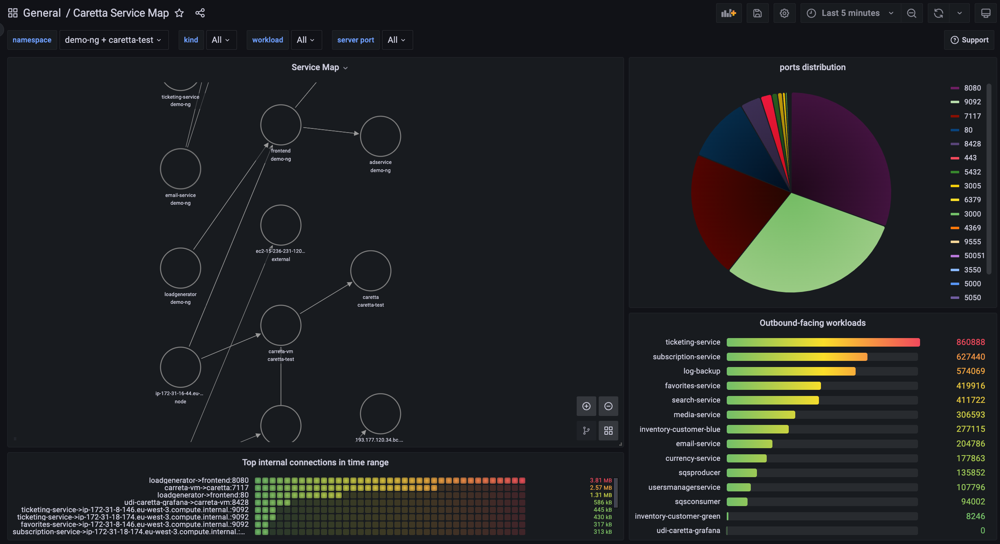

<div align="center">
  <h1>Caretta</h1>
  <p align="center">
    
   </p>
    <h2>Instant K8s service dependency map , right to your Grafana.</h2>
    <h4> made by <a href="https://www.groundcover.com">groundcover</h4>
  <p>


  [](http://www.groundcover.com/join-slack)
  [](https://opensource.org/licenses/Apache-2.0)
</div>


<p align="center">
    
</p>

## What is Caretta?

Caretta is a lightweight, standalone tool that instantly creates a visual network map of the services running in your cluster.

Carreta leverages eBPF to efficiently maps all service network interactions in a K8s  cluster, and Grafana to query and visualize the collected data.

Carreta is built to be efficient, with a minimal footprint on the system, and does not require any modifications or installation on the cluster.

Caretta demonstrates the power of using eBPF for observability solutions, which is our vision at <a href="https://groundcover.com">groundcover</a>. If you're interested in understanding how Caretta is built, head over to our <a href="">Caretta blog post!</a>

## Installing Caretta
```
helm repo add gc https://helm.groundcover.com/
helm update
helm install caretta gc/caretta
```

### Configuration
You can configure Caretta using helm values.
Useful values:
* **tolreations** can be specified to make sure Caretta's eBPF-agent will run on all cluster in your nodes. *default value will tolerate common control-plane node annotations*
* **persistentStorage.enabled** can be set to *true* if you wish to save Caretta's metrics to a persistent volume *default: false*
* **pollIntervalSeconds** can be modified to specify the polling and publishing interval of new metrics from the kernel. *default: 5*

## Consuming Caretta's data
Caretta's chart ships an instance of Grafana with pre-defined dashboard using data published by Caretta. This dashboard contains some examples to demonstrate the usage of Caretta's metrics.

Caretta uses Victoria Metrics to scrape its metrics, and the outcome can be consumed by **any Prometheus-compatible dashboard**.

Caretta's main metric is `caretta_links_observed` (Gauge). It uses the following labels to represent a specific connection (network socket) going through the cluster:
* `client_name` - either a name of a kubernetes entity, if resolved, an external domain, if resolved, or an IP address.
* `client_namespace` - either the namespace of the kubernetes entity, or "node", or "external".
* `client_kind` - either the kind of the kubernetes entity, or "node", or "external".
* `server_name` - either a name of a kubernetes entity, if resolved, an external domain, if resolved, or an IP address.
* `server_namespace` - either the namespace of the kubernetes entity, or "node", or "external".
* `server_kind` - either the kind of the kubernetes entity, or "node", or "external".
* `server_port` - the port used by the server.
* `role` - either 1 (client) or 2 (server).

Along those labels, Caretta uses other labels for Grafana's Node Graph panel.

## Need help?
Feel free to reach us at our <a href="http://www.groundcover.com/join-slack">slack channel</a>, or create an issue in this repository.

## Contribution
Feel free to add your contribution to the project.

* Open an issue for missing features, or bugs
* Create a pull request for adding code the project