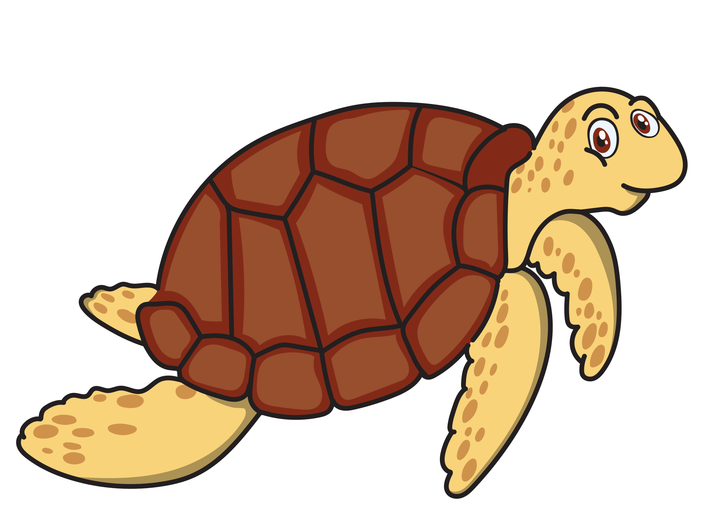

<div align="center">
  <h1>Caretta</h1>
  <p align="center">
    
   <br><br>
   <a href="https://www.producthunt.com/posts/caretta?utm_source=badge-featured&utm_medium=badge&utm_souce=badge-caretta" target="_blank"></a>
  </p>
    <h2>Instant K8s service dependency map , right to your Grafana.</h2>
    <h4> made by <a href="https://www.groundcover.com">groundcover</h4>
  <p>


  [](http://www.groundcover.com/join-slack)
  [](https://opensource.org/licenses/Apache-2.0)
  <br>
</div>


<p align="center">
    
</p>

## What is Caretta?

Caretta is a lightweight, standalone tool that instantly creates a visual network map of the services running in your cluster.

Carreta leverages eBPF to efficiently map all service network interactions in a K8s  cluster, and Grafana to query and visualize the collected data.

Carreta is built to be efficient, with a minimal footprint on the system, and does not require any modifications of the cluster.

Caretta demonstrates the power of using eBPF for observability solutions, which is our vision at <a href="https://groundcover.com">groundcover</a>. If you're interested in understanding how Caretta is built, head over to our <a href="https://www.groundcover.com/blog/caretta">Caretta blog post!</a>

## Installing Caretta :zap:
As simple as installing a helm chart. It is recommended to install Caretta in a new, unique namespace.
```bash
helm repo add groundcover https://helm.groundcover.com/
```
```bash
helm repo update
```
```bash
helm install caretta --namespace caretta --create-namespace groundcover/caretta
```

### Configuration
You can configure Caretta using helm values.
Useful values:
* **tolerations** can be specified to make sure Caretta's eBPF-agent will run on all cluster in your nodes. *default value will tolerate common control-plane node annotations*
* **victoria-metrics-single.server.persistentVolume.enabled** can be set to *true* if you wish to save Caretta's metrics to a persistent volume *default: false*
* **pollIntervalSeconds** can be modified to specify the polling and publishing interval of new metrics from the kernel. *default: 5*

Example yaml for overriding these values:
```yaml
pollIntervalSeconds: 15  # set metrics polling interval 

tolerations:             # set any desired tolerations
  - key: node-role.kubernetes.io/control-plane
    operator: Exists
    effect: NoSchedule
    
 victoria-metrics-single:
  server:
    persistentVolume:
       enabled: true   # set to true to use persistent volume
```
This can also be done using the --set flag on the `helm install` command.

### Uninstallation
To uninstall, delete the helm release:
```bash
helm delete caretta --namespace caretta
```
Note that if persistent storage was enabled in the installation, it may not be deleted automatically by this command.

## Requirements
* Linux kernel version >= 4.16
* x64 system
* <a href="https://nakryiko.com/posts/bpf-portability-and-co-re/">CO-RE</a> support. Supported linux distributions can be found <a href="https://github.com/libbpf/libbpf#bpf-co-re-compile-once--run-everywhere">here</a>. Specifically, Docker for Mac uses a distribution which is not currently supported.


## Working with Caretta :turtle:
Caretta's helm chart ships an instance of Grafana with a predefined dashboard using data published by Caretta. This dashboard contains some examples to demonstrate the usage of Caretta's metrics.

### Using the provided Grafana instance
To access Grafana, port-forward port `3000` from the Grafana pod in Caretta's namespace. 

Using *kubectl*, it should look something like this:

```bash
kubectl port-forward --namespace caretta <grafana-pod-name> 3000:3000
```

> **_NOTE:_**  Anonymous mode is enabled, making the default dashboard accessible with no login needed. 
>              To edit the default dashboard or create your own dashboard, use the default administrator's credentials user:`admin` ; password:`caretta`.

### Scraping Caretta's metrics

Caretta uses [Victoria Metrics](https://victoriametrics.com/) to collect and publish its metrics, and the outcome can be consumed by **any Prometheus-compatible dashboard**.

Caretta's main metric is `caretta_links_observed` (Gauge). It uses the following labels to represent a specific connection (network socket) going through the cluster:
* `client_name` - either a name of a kubernetes entity, if resolved, an external domain, if resolved, or an IP address.
* `client_namespace` - either the namespace of the kubernetes entity, or "node", or "external".
* `client_kind` - either the kind of the kubernetes entity, or "node", or "external".
* `server_name` - either a name of a kubernetes entity, if resolved, an external domain, if resolved, or an IP address.
* `server_namespace` - either the namespace of the kubernetes entity, or "node", or "external".
* `server_kind` - either the kind of the kubernetes entity, or "node", or "external".
* `server_port` - the port used by the server.
* `role` - either 1 (client) or 2 (server).

Along those labels, Caretta uses other labels for Grafana's Node Graph panel.

#### Example metric data
This example shows a connection between a client named `checkoutservice`, controlled by a deployment, to a service named `productioncatalogservice` on port 3550, from the perspective of the client. Total bytes sent by the client in this connection is 2537 bytes.
```bash
caretta_links_observed{client_id="1074587981",client_kind="Deployment",client_name="checkoutservice",client_namespace="demo-ng",link_id="198768460",role="1",server_id="1112713827",server_kind="Service",server_name="productcatalogservice",server_namespace="demo-ng",server_port="3550"} 2537
```

#### Example queries  :star:
```bash 
increase ((sum (server_port) (caretta_links_observed{client_name="some-client", server_name="some-server}))[15m]) 
```
` will output the throughput observed between some-client and some-server in the last 15 minutes, aggregated by port.

```bash 
sum by (server_name) (rate(caretta_links_observed{client_name="some-client"}))
```
will output the rate of traffic from some-client to servers it communicates with, aggregated by the server's name.

```bash 
sort_desc(increase((sum by (client_name)(caretta_links_observed{server_namespace="external"}))[5m])) 
```
will output communication to external servers by client's name, sorted descending.

## Need help:grey_question:
Feel free to reach us on our <a href="http://www.groundcover.com/join-slack">slack channel</a>, or create an issue in this repository.

## Contribution
Feel free to add your contribution to the project.

* Open an issue for missing features, or bugs
* Create a pull request for adding code to the project
